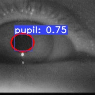
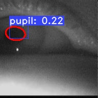
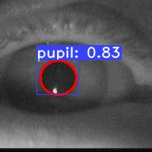

A simple, fully convolutional model for real-time pupil segmentation. 
This code is based on original yolact:
 - [YOLACT: Real-time Instance Segmentation](https://arxiv.org/abs/1904.02689)
 - [YOLACT++: Better Real-time Instance Segmentation](https://arxiv.org/abs/1912.06218)

#### YOLACT++ (v1.2) released! ([Changelog](CHANGELOG.md))
YOLACT++'s resnet50 model runs at 33.5 fps on a Titan Xp and achieves 34.1 mAP on COCO's `test-dev` (check out our journal paper [here](https://arxiv.org/abs/1912.06218)).

In order to use YOLACT++, make sure you compile the DCNv2 code. (See [Installation](https://github.com/dbolya/yolact#installation))

Some examples from our YOLACT base model:

 , , 

# Installation
 - Clone this repository and enter it:
   ```Shell
   git clone https://github.com/dbolya/yolact.git
   cd yolact
   ```
 - Set up the environment using one of the following methods:
   - Using [Anaconda](https://www.anaconda.com/distribution/)
     - Run `conda env create -f environment.yml`
     - Run `conda activate yolact-env`
     
   - Manually with pip
     - Set up a Python3 environment (e.g., using virtenv).
     - Install [Pytorch](http://pytorch.org/) 1.0.1 (or higher) and TorchVision.
     - Install some other packages:
       ```Shell
       # Cython needs to be installed before pycocotools
       pip install cython
       pip install opencv-python pillow pycocotools matplotlib
       pip install circle-fit
       ```
  - If you want to use YOLACT++, compile deformable convolutional layers (from [DCNv2](https://github.com/CharlesShang/DCNv2/tree/pytorch_1.0)).
   Make sure you have the latest CUDA toolkit installed from [NVidia's Website](https://developer.nvidia.com/cuda-toolkit).
   ```Shell
   cd external/DCNv2
   python setup.py build develop
   ```

## Custom Datasets
You can train you own dataset by following these steps:
 - Create a xml annotation file for your dataset. One file per image. The example for this can be found at 
 ```
 ./data/pupil_original-data
 ```
 - Copy your data to the folder above
 
 - To use our data augmentation method add noisy videos at. Or use our defulat videos:
  ```
 ./data/pupil_noisy_videos
 ```
 - Convert your xml anotation files to the json with coco Stndard. The new files will be located at "Train/test" folder:
    ```Shell
    python ./pupil_detector/export_coco_standard.py --images_dir=./data/pupil_original-data/ --annotaded_dir=./data/pupil_annotaded_data --ag_flag=True  --ag_percentage=100  --eval_dataset_flag=False
   ```
 -Convert your annoation with agumentation to one json file based on Coco standard:
   ```Shell
   python ./pupil_detector/Coco_Dataset_Creator.py  --input_dir=./data/pupil_annotaded_data/train --output_dir=./data/pupil_annotaded_data/yolact_datasets_train --labels=./pupil_detector/labels.txt
   
   python ./pupil_detector/Coco_Dataset_Creator.py  --input_dir=./data/pupil_annotaded_data/test --output_dir=./data/pupil_annotaded_data/yolact_datasets_test --labels=./pupil_detector/labels.txt
   ``` 
# Training
We trained out model based on the dataset presneted in paperXXX.
 - To train, grab an pretrained model and put it in `./weights`.
   - For our weight, download `XXXX.pth` from [here](https://XXXX).

 - Run training command below.
   ```Shell
   python train.py --config=yolact_base_config --resume=./weights/yolact_plus_resnet50_54_800000.pth --start_iter=0 --batch_size=8
   ```
   
# Weights
Here are orinial YOLACT models (released on April 5th, 2019) along with their FPS on a Titan Xp and mAP on `test-dev`:

| Image Size | Backbone      | FPS  | mAP  | Weights                                                                                                              |  |
|:----------:|:-------------:|:----:|:----:|----------------------------------------------------------------------------------------------------------------------|--------|
| 550        | Resnet50-FPN  | 42.5 | 28.2 | [yolact_resnet50_54_800000.pth](https://drive.google.com/file/d/1yp7ZbbDwvMiFJEq4ptVKTYTI2VeRDXl0/view?usp=sharing)  | [Mirror](https://ucdavis365-my.sharepoint.com/:u:/g/personal/yongjaelee_ucdavis_edu/EUVpxoSXaqNIlssoLKOEoCcB1m0RpzGq_Khp5n1VX3zcUw) |
| 550        | Darknet53-FPN | 40.0 | 28.7 | [yolact_darknet53_54_800000.pth](https://drive.google.com/file/d/1dukLrTzZQEuhzitGkHaGjphlmRJOjVnP/view?usp=sharing) | [Mirror](https://ucdavis365-my.sharepoint.com/:u:/g/personal/yongjaelee_ucdavis_edu/ERrao26c8llJn25dIyZPhwMBxUp2GdZTKIMUQA3t0djHLw)
| 550        | Resnet101-FPN | 33.5 | 29.8 | [yolact_base_54_800000.pth](https://drive.google.com/file/d/1UYy3dMapbH1BnmtZU4WH1zbYgOzzHHf_/view?usp=sharing)      | [Mirror](https://ucdavis365-my.sharepoint.com/:u:/g/personal/yongjaelee_ucdavis_edu/EYRWxBEoKU9DiblrWx2M89MBGFkVVB_drlRd_v5sdT3Hgg)
| 700        | Resnet101-FPN | 23.6 | 31.2 | [yolact_im700_54_800000.pth](https://drive.google.com/file/d/1lE4Lz5p25teiXV-6HdTiOJSnS7u7GBzg/view?usp=sharing)     | [Mirror](https://ucdavis365-my.sharepoint.com/:u:/g/personal/yongjaelee_ucdavis_edu/Eagg5RSc5hFEhp7sPtvLNyoBjhlf2feog7t8OQzHKKphjw)

YOLACT++ models (released on December 16th, 2019):python train.py --config=yolact_base_config --resume=./weights/yolact_plus_resnet50_54_800000.pth --start_iter=0 --batch_size=8

| Image Size | Backbone      | FPS  | mAP  | Weights                                                                                                              |  |
|:----------:|:-------------:|:----:|:----:|----------------------------------------------------------------------------------------------------------------------|--------|
| 550        | Resnet50-FPN  | 33.5 | 34.1 | [yolact_plus_resnet50_54_800000.pth](https://drive.google.com/file/d/1ZPu1YR2UzGHQD0o1rEqy-j5bmEm3lbyP/view?usp=sharing)  | [Mirror](https://ucdavis365-my.sharepoint.com/:u:/g/personal/yongjaelee_ucdavis_edu/EcJAtMiEFlhAnVsDf00yWRIBUC4m8iE9NEEiV05XwtEoGw) |
| 550        | Resnet101-FPN | 27.3 | 34.6 | [yolact_plus_base_54_800000.pth](https://drive.google.com/file/d/15id0Qq5eqRbkD-N3ZjDZXdCvRyIaHpFB/view?usp=sharing) | [Mirror](https://ucdavis365-my.sharepoint.com/:u:/g/personal/yongjaelee_ucdavis_edu/EVQ62sF0SrJPrl_68onyHF8BpG7c05A8PavV4a849sZgEA)

YOLACT++ pupil models :
| Image Size | Backbone      | FPS  | mAP  | Weights                                                                                                              |  |
|:----------:|:-------------:|:----:|:----:|----------------------------------------------------------------------------------------------------------------------|--------|
| 550        | RXXXX  | 33.5 | 34.1 | [XXX.pth](https://XXXX)  | [Mirror](https://XXXX)

## Results and evaluation
- Create a xml annotation file for your dataset. One file per image. The example for this can be found at 
 ```
 ./data/pupil_original-data
 ```
- Copy your data to the folder above
- Convert your xml anotation files to the json with coco Stndard. The new files will be located at "test" folder:
    ```Shell
    python ./pupil_detector/export_coco_standard.py --images_dir=./data/pupil_original-data/ --annotaded_dir=./data/pupil_annotaded_data --ag_flag=False  --eval_dataset_flag=True
   ``` 
- Convert your annoation with agumentation to one json file based on Coco standard:
   ```Shell
   python ./pupil_detector/Coco_Dataset_Creator.py  --input_dir=./data/pupil_annotaded_data/test --output_dir=./data/pupil_annotaded_data/yolact_datasets_test --labels=./pupil_detector/labels.txt
  ```
- Run evaluation command below:
   ```Shell
   python eval.py --trained_model=./weights/yolact_base_205_8000.pth --save_pupil_evaluate_image=True
  ```
  
## Multi-GPU Support
YOLACT now supports multiple GPUs seamlessly during training:

 - Before running any of the scripts, run: `export CUDA_VISIBLE_DEVICES=[gpus]`
   - Where you should replace [gpus] with a comma separated list of the index of each GPU you want to use (e.g., 0,1,2,3).
   - You should still do this if only using 1 GPU.
   - You can check the indices of your GPUs with `nvidia-smi`.
 - Then, simply set the batch size to `8*num_gpus` with the training commands above. The training script will automatically scale the hyperparameters to the right values.
   - If you have memory to spare you can increase the batch size further, but keep it a multiple of the number of GPUs you're using.
   - If you want to allocate the images per GPU specific for different GPUs, you can use `--batch_alloc=[alloc]` where [alloc] is a comma seprated list containing the number of images on each GPU. This must sum to `batch_size`.

## Logging
YOLACT now logs training and validation information by default. You can disable this with `--no_log`. A guide on how to visualize these logs is coming soon, but now you can look at `LogVizualizer` in `utils/logger.py` for help.


# Citation
If you use YOLACT or this code base in your work, please cite
```
@inproceedings{yolact-iccv2019,
  author    = {Daniel Bolya and Chong Zhou and Fanyi Xiao and Yong Jae Lee},
  title     = {YOLACT: {Real-time} Instance Segmentation},
  booktitle = {ICCV},
  year      = {2019},
}
```

For YOLACT++, please cite
```
@misc{yolact-plus-arxiv2019,
  title         = {YOLACT++: Better Real-time Instance Segmentation},
  author        = {Daniel Bolya and Chong Zhou and Fanyi Xiao and Yong Jae Lee},
  year          = {2019},
  eprint        = {1912.06218},
  archivePrefix = {arXiv},
  primaryClass  = {cs.CV}
}
```
For pupil detection model, please cite
```
@inproceedings{eivazi2019improving,
  title={Improving real-time CNN-based pupil detection through domain-specific data augmentation},
  author={Eivazi, Shaharam and Santini, Thiago and Keshavarzi, Alireza and K{\"u}bler, Thomas and Mazzei, Andrea},
  booktitle={Proceedings of the 11th ACM Symposium on Eye Tracking Research \& Applications},
  pages={1--6},
  year={2019}
}
```


# Contact
For questions about our paper or code, please contact https://www.hci.uni-tuebingen.de/chair/team/shahram-eivazi.
